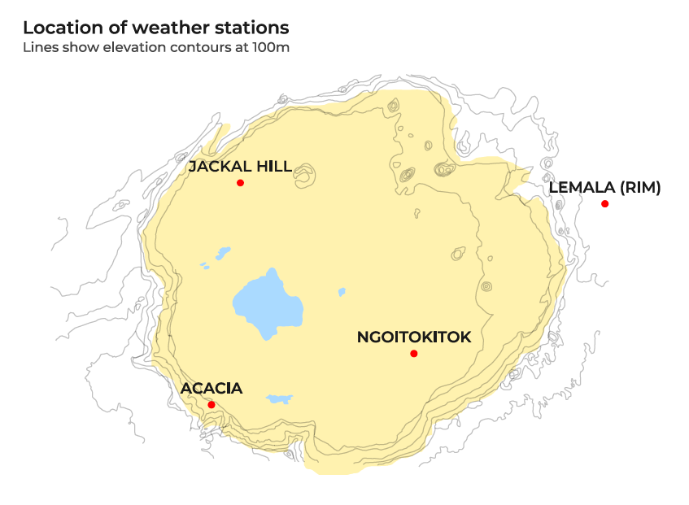
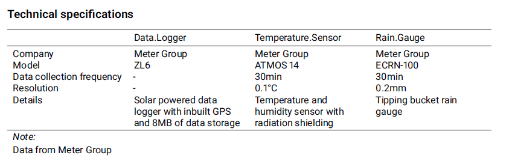

# Hyena Project weather data

## Introduction 

This public repository allows access to the detailed weather data collected by the [Ngorongoro Hyena Project](https://hyena-project.com/) in Ngornogor Crater, Tanzania. The data have been collected to study the population of spotted hyena (*Crocuta crocuta*) in the Ngorongoro Crater, Tanzania but are made publicly available for any researchers or managers to use. The repository contains 4 sections:

- [Weather station network details](#network): A general overview of the weather station network established in Ngorongoro Crater, including station locations, data collection frequency and variables measured.

- [Recent report](#report): The most recent .pdf report summarising weather patterns and trends in Ngorongoro Crater since weather data collection began in September, 2021. This is intended as a high-level summary of weather patterns that may be used by managers and decision makers.

- [Summary data](#summarydata): Daily summary data from all stations within the weather data network.

- [Raw data](#rawdata): Full high-frequency weather dataset.

<a name="network"/>

## Weather station network details

The weather station run by Ngorongoro Hyena project includes 4 weather station sites within the Ngorongoro Conservation Area. 3 of these sites are found on the Crater floor and 1 on the Crater rim (Fig. 1).

All stations include a temperature sensor and and tipping bucket rain gauge. Technical specifications are described below and also included in the report.

<a name="report"/>

## Recent report

The most recent weather data report is available [here](report/NCAA_weather_report_Hyena_Project.pdf). This report is intended as a general summary of weather patterns and trends for managers and decision makers.

When using or referencing the Ngorongoro Crater Weather Report, please credit the members of the Ngorongoro Hyena Project who have compiled the data and generated the report, and cite as follows:

> Bailey LD, Philemon Naman, Oltumo L, Courtiol A, Davidian E, Höner OP. Ngorongoro Crater Weather Report: Graphical representation of the trends in temperature, rainfall and atmospheric pressure in the Ngorongoro Crater, Tanzania. Downloaded on [date] from https://github.com/hyenaproject/NgoroWeather.

<a name="summarydata"/>

## Summary data

Daily average weather data is available [here](data/summary).

When using or referencing the Ngorongoro Crater Weather Data in part or in whole, please credit members of the Ngorongoro Hyena Project who are responsible for the funding, installation, and maintenance of the four weather stations and for the curation of the data, as follows:

> Bailey LD, Philemon Naman, Oltumo L, Courtiol A, Davidian E, Höner OP. Ngorongoro Crater Weather Data: Temperature, rainfall and atmospheric pressure in the Ngorongoro Crater, Tanzania. Downloaded on [date] from https://github.com/hyenaproject/NgoroWeather.

<a name="rawdata"/>

## Raw data

High-frequency (30 minute) weather data is available [here](data/raw).

When using or referencing the Ngorongoro Crater Weather Data in part or in whole, please credit members of the Ngorongoro Hyena Project who are responsible for the funding, installation, and maintenance of the four weather stations and for the curation of the data, as follows:

> Bailey LD, Philemon Naman, Oltumo L, Courtiol A, Davidian E, Höner OP. Ngorongoro Crater Weather Data: Temperature, rainfall and atmospheric pressure in the Ngorongoro Crater, Tanzania. Downloaded on [date] from https://github.com/hyenaproject/NgoroWeather.

