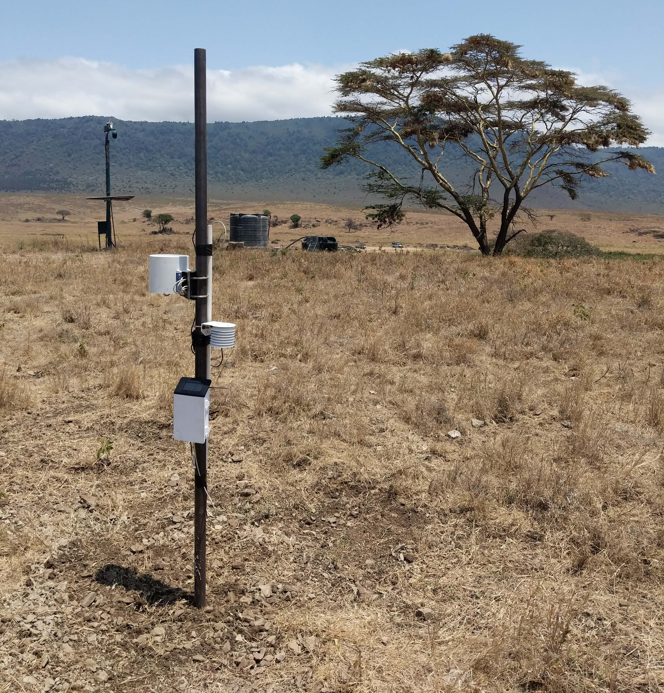
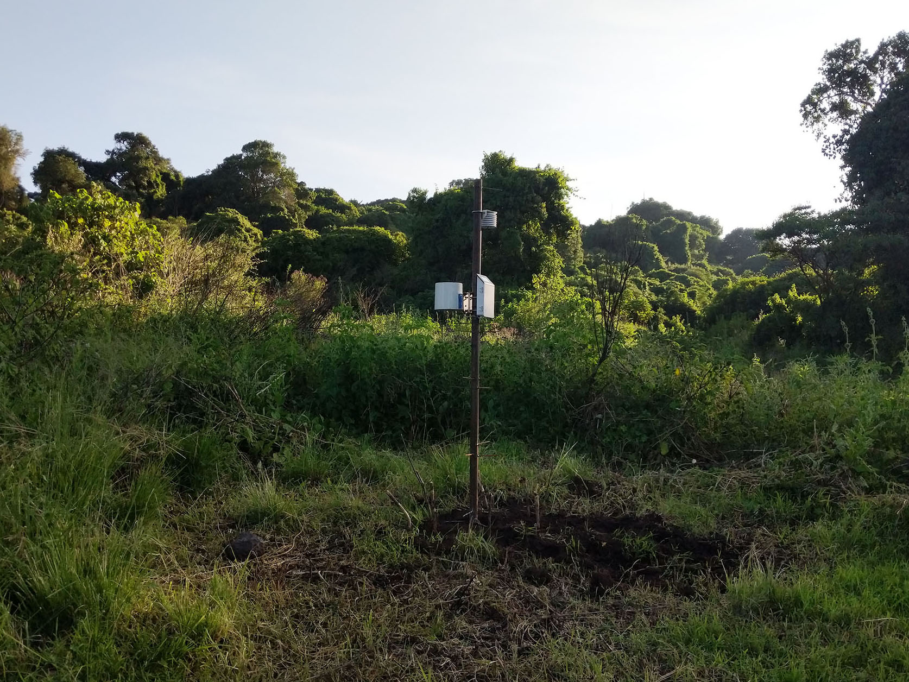

<!-- Import custom fonts that are used in .css file --> 
<link href="https://fonts.googleapis.com/css2?family=Montserrat:ital,wght@0,100;0,200;0,300;0,400;0,500;0,600;0,700;0,800;0,900;1,100;1,200;1,300;1,400;1,500;1,600;1,700;1,800;1,900&display=swap" rel="stylesheet">

```{r, include = FALSE}

knitr::opts_chunk$set(message = FALSE)

```

```{r load_pkgs, include = FALSE}

library(hyenaR)
library(NgoroWeather)
library(here)
library(dplyr)
library(tidyr)
library(stringr)
library(lubridate)
library(ggplot2)
library(ggtext)
library(patchwork)
library(gt)
library(sf)
library(showtext)
# library(leaflet)
# library(mapview)
# library(osmdata)

```

```{r load_fonts, include = FALSE}

font_add_google(name = "Montserrat", family = "Montserrat100", regular.wt = 100, bold.wt = 200)
font_add_google(name = "Montserrat", family = "Montserrat200", regular.wt = 200, bold.wt = 300)
font_add_google(name = "Montserrat", family = "Montserrat300", regular.wt = 300, bold.wt = 400)
font_add_google(name = "Montserrat", family = "Montserrat400", regular.wt = 400, bold.wt = 500)
font_add_google(name = "Montserrat", family = "Montserrat500", regular.wt = 500, bold.wt = 600)
font_add_google(name = "Montserrat", family = "Montserrat600", regular.wt = 600, bold.wt = 700)
font_add_google(name = "Montserrat", family = "Montserrat700", regular.wt = 700, bold.wt = 800)
font_add_google(name = "Montserrat", family = "Montserrat800", regular.wt = 800, bold.wt = 900)
font_add_google(name = "Montserrat", family = "Montserrat900", regular.wt = 900, bold.wt = 900)
showtext_auto()
showtext_opts(dpi = 300)

```

```{r load_db, include=FALSE}
load_package_database.weather(input.folder = "../../data/raw",
                              overwrite.db = "yes")
```

```{r, include = FALSE}

#For now, just use all data. (we leave location/station blank to return all locations)
input_data <- create_crater_weather.table(variable = c("air_temp", "precip")) |> 
  # Convert locations to title case for text
  dplyr::mutate(site_name_title = dplyr::case_when(site_name == "jackal_hill" ~ "Jackal Hill",
                                                   site_name == "lemala_rim" ~ "Lemala (Rim)",
                                                   TRUE ~ stringr::str_to_title(site_name)))

all_names <- unique(input_data$site_name_title)

start_date <- min(lubridate::as_date(input_data$date_time))
end_date   <- max(lubridate::as_date(input_data$date_time))

days_per_station <- input_data |> 
  mutate(date = lubridate::as_date(date_time, tz = "Africa/Dar_es_Salaam")) |> 
  group_by(site_name) |> 
  summarise(n = length(unique(date)), .groups = "drop")

total_days <- sum(days_per_station$n)

```

&nbsp;
&nbsp;

-----

# Introduction

This report gives a summary of weather data collected in Ngorongoro Crater by the Ngorongoro Hyena Project between `r format(start_date, "%d/%m/%Y")` - `r format(end_date, "%d/%m/%Y")`. Below are some key facts from our data collection so far.

&nbsp;

```{r nr_days_BAN, echo = FALSE, fig.height=1.25, fig.width=5, fig.align='center'}

number_days <- as.numeric(end_date - start_date)

ggplot() +
  geom_richtext(data = NULL, aes(x = 0.5, y = 0.5, label = glue::glue("<span style='color:grey10; font-size:30pt'>**{BAN} days**</span><br><span style='color:grey25; font-size:10pt'>of weather data collected<br>since {date}</span>",
                                                                      BAN = number_days,
                                                                      date = format(start_date, "%d/%m/%Y"))),
                fill = NA, label.color = NA, family = "Montserrat500") +
  scale_y_continuous(limits = c(0.45, 0.55)) +
  theme_void()

```

```{r max_temp_BAN, echo = FALSE, fig.height=1.25, fig.width=5, fig.align='center'}

max_temp <- input_data |> 
  filter(air_temp == max(air_temp))

ggplot() +
  geom_richtext(data = max_temp, aes(x = 0.5, y = 0.5, label = glue::glue("<span style='color:#D2042D; font-size:30pt'>**{BAN}°C**</span><br><span style='color:grey25; font-size:10pt'>Highest recorded temperature<br>{site}<br>{date}</span>",
                                                                          BAN = air_temp,
                                                                          site = site_name,
                                                                          date = format(date_time, "%d/%m/%Y"))),
                fill = NA, label.color = NA, family = "Montserrat500") +
  scale_y_continuous(limits = c(0.45, 0.55)) +
  theme_void()

```

```{r min_temp_BAN, echo = FALSE, fig.height=1.25, fig.width=5, fig.align='center'}

min_temp <- input_data |> 
  filter(air_temp == min(air_temp))

ggplot() +
  geom_richtext(data = min_temp, aes(x = 0.5, y = 0.5, label = glue::glue("<span style='color:#0DA2FF; font-size:30pt'>**{BAN}°C**</span><br><span style='color:grey25; font-size:10pt'>Lowest recorded temperature<br>{site}<br>{date}</span>",
                                                                          BAN = air_temp,
                                                                          site = site_name,
                                                                          date = format(date_time, "%d/%m/%Y"))),
                fill = NA, label.color = NA, family = "Montserrat500") +
  scale_y_continuous(limits = c(0.45, 0.55)) +
  theme_void()

```

```{r max_rain_BAN, echo = FALSE, fig.height=1.25, fig.width=5, fig.align='center'}

daily_sum <- input_data |> 
  mutate(date = lubridate::as_date(date_time)) |> 
  group_by(site_name, date) |> 
  summarise(total_rain = sum(precip), .groups = "drop")

max_rain <- daily_sum |> 
  filter(total_rain == max(total_rain))

ggplot() +
  geom_richtext(data = max_rain, aes(x = 0.5, y = 0.5, label = glue::glue("<span style='color:#1434A4; font-size:30pt'>**{BAN}mm**</span><br><span style='color:grey25; font-size:10pt'>Highest recorded daily rainfall<br>{site}<br>{date}</span>",
                                                                          BAN = total_rain,
                                                                          site = site_name,
                                                                          date = format(date, "%d/%m/%Y"))),
                fill = NA, label.color = NA, family = "Montserrat500") +
  scale_y_continuous(limits = c(0.45, 0.55)) +
  theme_void()

```

&nbsp;
&nbsp;
&nbsp;

In the following sections you will find more details on the weather data collected:

- [**Weather station details**](#station_details) provides technical details of the weather stations used, including location and technical specifications.

- [**Data summary**](#data_summary) provides summarised information on temperature and rainfall collected across all stations.

- [**Detailed weather data by site**](#per_station) provides detailed temperature and weather data for each weather station individually.

&nbsp;
&nbsp;

-----

# Weather station details {.tabset .tabset-fade #station_details}

&nbsp;

**Click the tabs to change between the map, photos, and technical specifications.**

&nbsp;

## Map

```{r static_map, echo=FALSE, warning=FALSE}

crater_rim <- hyenaR::sf_hyenaR$rim_polygon

crater_contours <- hyenaR::sf_hyenaR$crater_contours

station_points <- dplyr::bind_cols(weather_station_activity, sf::st_coordinates(weather_station_activity))

lakes <- hyenaR::sf_hyenaR$waterbodies_lakes

#Only show roads INSIDE the crater
roads <- hyenaR::sf_hyenaR$roads_crater |> 
  sf::st_crop(crater_rim)

rivers <- hyenaR::sf_hyenaR$rivers_all |> 
  sf::st_crop(crater_rim)

map <- ggplot() +
  geom_sf(data = crater_rim, fill = "#FFF2AF", colour = NA) +
  geom_sf(data = crater_contours, fill = "#FFF2AF", alpha = 0.25) +
  geom_sf(data = lakes, fill = "#AADAFF", colour = NA) +
  # geom_sf(data = rivers, colour = "#AADAFF") +
  # geom_sf(data = roads, colour = "grey25", alpha = 0.75) +
  geom_sf(data = station_points, colour = "red") +
  geom_text(data = station_points, aes(x = X, y = Y + 0.0075, label = toupper(site_name)),
            family = "Montserrat500", fontface = "bold", colour = "grey10") +
  labs(title = "Location of weather stations",
       subtitle = "Lines show elevation contours at 100m") +
  theme_void() +
  theme(plot.title = element_text(family = "Montserrat500", colour = "grey10", face = "bold"),
        plot.subtitle = element_text(family = "Montserrat500", colour = "grey25"))

# ggsave(map, filename = "/home/bailey/weather_data_reports/figs/map.png", dpi = 300)

map

```

```{r leaflet_map, eval=FALSE, echo=FALSE}

### THIS CODE IS CURRENTLY NOT USED TO REDUCE FILE SIZE
### HOWEVER, WE MAY WANT TO USE AN INTERACTIVE MAP IN OTHER CIRCUMSTANCES SO CODE IS KEPT HERE

## ACACIA SITE

#Load data
station <- weather_station_activity |> 
  filter(location == "acacia")

#Corresponding station image
station_image <- "assets/acacia_close.jpg"

## JUA DATA

#Load data
station_jua <- weather_station_activity |> 
  filter(location == "ngoitokitok")

#Corresponding station image
station_image_jua <- "assets/ngoitokitok_close.jpg"

leaflet() |> 
  addProviderTiles(providers$Esri.WorldImagery, group="Satellite") |>
  addProviderTiles(providers$OpenTopoMap, group="Topographic map") |>
  addLayersControl(baseGroups=c('Satellite', 'Topographic map')) |>  
  setView(lat = -3.1769, lng = 35.5569, zoom = 12) |> 
  # addAwesomeMarkers(data = photo_sites, label = ~name,
  #                   icon = awesomeIcons(
  #                     icon = 'camera',
  #                     iconColor = 'black'
  #                   ),
  #                   popup = leafpop::popupImage(photo_site_images,
  #                                               src = "local",
  #                                               embed = TRUE,
  #                                               height = 400,
  #                                               width = 400)) |> 
  addMarkers(data = station, label = "Acacia weather station",
             popup = leafpop::popupImage(station_image,
                                         src = "local",
                                         embed = TRUE,
                                         height = 400,
                                         width = 400)) |> 
  addMarkers(data = station_jua, label = "Ngoitokitok weather station",
             popup = leafpop::popupImage(station_image_jua,
                                         src = "local",
                                         embed = TRUE,
                                         height = 400,
                                         width = 400))

```

## Acacia station photo

```{r, echo=FALSE,out.width="50%", out.height="50%",fig.cap="Acacia Station",fig.show='hold',fig.align='center'}

```

## Ngoitokitok station photo

```{r, echo=FALSE,out.width="50%", out.height="50%",fig.cap="Ngoitokitok Station",fig.show='hold',fig.align='center'}

```

## Jackal Hill station photo

```{r, echo=FALSE,out.width="50%", out.height="50%",fig.cap="Jackal Hill Station",fig.show='hold',fig.align='center'}

```

## Lemala (rim) station photo

```{r, echo=FALSE,out.width="50%", out.height="50%",fig.cap="Lemala () Station",fig.show='hold',fig.align='center'}

```

## Technical specifications

```{r tech_specs, echo = FALSE}

specs <- data.frame(variable = c("Company", "Model", "Data collection frequency", "Resolution", "Details"),
                    logger = c("Meter Group", "ZL6", "-", "-", "Solar powered data logger with inbuilt GPS and 8MB of data storage"),
                    temp = c("Meter Group", "ATMOS 14", "30min", "0.1°C", "Temperature and humidity sensor with radiation shielding"),
                    rain = c("Meter Group", "ECRN-100", "30min", "0.2mm", "Tipping bucket rain gauge"))


specs |>
  gt() |> 
  cols_width(variable ~ px(120),
             everything() ~ px(80)) |> 
  cols_label(variable = "",
             logger = "Data Logger",
             temp = "Temperature Sensor",
             rain = "Rain Gauge") |> 
  cols_align(align = "center", columns = -variable) |> 
  tab_header(title = md("Weather station technical specifications"),
             subtitle = md("Specifications of equipment used in all stations")) |> 
  tab_source_note(source_note = "Data: Meter Group") |> 
  tab_style(
    locations = cells_column_labels(columns = everything()),
    style     = list(
      cell_borders(sides = "bottom", weight = px(3)),
      cell_text(weight = "bold")
    )
  ) |> 
  tab_style(
    locations = cells_title(groups = "title"),
    style     = list(
      cell_text(weight = "bold", size = 24)
    )
  ) |> 
  opt_all_caps() |> 
  opt_table_font(
    font = list(
      google_font("Montserrat"),
      default_fonts()
    )
  ) |>
  tab_options(
    column_labels.border.top.width = px(3),
    column_labels.border.top.color = "#FFFFFF00",
    table.border.top.color = "#FFFFFF00",
    table.border.bottom.color = "#FFFFFF00",
    data_row.padding = px(12),
    source_notes.font.size = 11,
    heading.align = "left",
    #Adjust grouped rows to make them stand out
    row_group.background.color = "grey",
    table.width = px(750))

```

# {.unlisted .unnumbered}

&nbsp;
&nbsp;

-----

# Data summary <br> (`r format(start_date, "%d/%m/%Y")` - `r format(end_date, "%d/%m/%Y")`) {#data_summary}

&nbsp;
&nbsp;

<hr style='border-top: 2px solid #7f7f7f'>

## Temperature

### Mean temperature (°C) over time

The below plot covers the period `r format(start_date, "%d/%m/%Y")` - `r format(end_date, "%d/%m/%Y")`. It shows the daily mean temperature calculated across all stations (solid black line) and the daily temperature range for each station individually (shaded areas). Temperature range at Acacia station is seen in dark grey and Ngoitokitok station is seen in light grey. The table beneath the plot shows monthly mean temperature for each station separately. Cell colours help to distinguish cooler months (yellow) from warmer months (red).

```{r temp_graph1, echo = FALSE}

#Determine mean of each day from across both stations
daily_mean <- input_data |> 
  #Only deal with stations on crater floor
  filter(site_name != "lemala_rim") |> 
  mutate(date = lubridate::as_date(date_time)) |> 
  group_by(date) |> 
  summarise(daily_mean = mean(air_temp),
            .groups = "drop") |> 
  mutate(date_time = lubridate::ymd_hms(paste(date, "12:00:00"), tz = "Africa/Dar_es_Salaam")) |> 
  #Remove the last day because it can often be a bit weird if we don't have all data
  slice(-n())

#Take daily max and min from each station (30min is too frequent)
thinned_data <- input_data |> 
  filter(site_name != "lemala_rim") |> 
  mutate(date = lubridate::as_date(date_time)) |> 
  group_by(date) |> 
  summarise(min = min(air_temp),
            max = max(air_temp),
            .groups = "drop")

all_temp_1 <- ggplot() +
  geom_ribbon(data = thinned_data, aes(x = date, ymin = min, ymax = max), alpha = 0.5, fill = "grey20") +
  geom_line(data = daily_mean, aes(x = date, y = daily_mean), linewidth = 1, colour = "black") +
  geom_text(data = daily_mean |> 
              slice(n()), aes(x = date + 2, y = daily_mean, label = "AVG"),
            hjust = 0, family = "Montserrat600", fontface = "bold") + 
  scale_x_date(name = "", date_labels = "%d/%m/%Y", limits = c(as.Date(NA), Sys.Date())) +
  scale_y_continuous(name = "Air temperature (°C)", limits = c(-10, 40), expand = c(0, 0)) +
  coord_cartesian(clip = "off") +
  labs(title = paste0("Temperature on Ngorongoro Crater floor ranged between <br>", paste(paste0(round(range(filter(input_data, site_name != "lemala_rim")$air_temp), 0), "°C"), collapse = " - ")),
       subtitle = "Grey shaded area shows daily range.<br>Solid black line is the daily mean temperature across all stations.") +
  theme_classic() +
  theme(legend.position = "none",
        plot.margin = margin(r = 10,
                             l = 10,
                             t = 10,
                             b = 10),
        plot.title = element_markdown(family = "Montserrat600", size = 18),
        plot.subtitle = element_markdown(family = "Montserrat300", size = 14),
        axis.text = element_text(size = 14, family = "Montserrat400", colour = "grey10"),
        axis.title = element_text(size = 16, family = "Montserrat400", face = "bold", colour = "grey10"),
        axis.line = element_line(colour = "grey10"))

# ggsave(all_temp_1, filename = "/home/bailey/weather_data_reports/figs/all_temp.png", dpi = 300)

all_temp_1

```

```{r temp_graph2, include = FALSE}

#### WHEN WE KNIT WE WILL ALSO GENERATE A SQUARE VECTOR GRAPH THAT IS USED ON WEBSITE

all_temp_square <- ggplot() +
  geom_ribbon(data = thinned_data, aes(x = date, ymin = min, ymax = max, fill = site_name), alpha = 0.5) +
  geom_line(data = daily_mean, aes(x = date, y = daily_mean), size = 1, colour = "black") +
  geom_text(data = slice(daily_mean, n()), aes(x = date + 2, y = daily_mean, label = "MEAN"),
            hjust = 0, family = "Montserrat600", fontface = "bold") +
  geom_text(data = data.frame(x = as.Date("2022-01-20"),
                              y = 17.6 + c(11.5, -10),
                              label = c("ACACIA", "NGOITOKITOK")),
            aes(x = x, y = y, label = label, colour = label),
            hjust = 0.15, family = "Montserrat600", fontface = "bold", alpha = 0.5) +
  scale_fill_manual(values = c("grey25", "grey75")) +
  scale_colour_manual(values = c("grey25", "grey75")) +
  scale_x_date(name = "", date_labels = "%d/%m/%Y", limits = c(as.Date(NA), as.Date("2022-02-7"))) +
  scale_y_continuous(name = "Air temperature (°C)", limits = c(0, 40), expand = c(0, 0)) +
  coord_cartesian(clip = "off") +
  # labs(title = paste0("Temperature ranged between ", paste(paste0(round(range(input_data$air_temp), 0), "°C"), collapse = " - "))) +
  theme_classic() +
  theme(legend.position = "none",
        axis.text = element_text(size = 12, family = "Montserrat400", colour = "grey10"),
        axis.title = element_text(size = 14, family = "Montserrat400", face = "bold", colour = "grey10"),
        axis.line = element_line(colour = "grey10"),
        plot.margin = margin(t = 85, b = 85, r = 25, l = 25),
        panel.background = element_blank())

# ggsave(all_temp_square, filename = "/home/bailey/weather_data_reports/figs/all_temp.svg", height = 10, width = 10)

```

```{r temp_heatmap, echo = FALSE}

## Create list of possible dates for each station
possible_dates <- input_data |> 
  group_by(site_name_title) |> 
  reframe(date = seq.Date(from = lubridate::floor_date(min(as.Date(date_time)), unit = "month"),
                          to = lubridate::ceiling_date(max(as.Date(date_time)), unit = "month") - 1, by = "day"))

daily_data <- input_data |>
  mutate(date = lubridate::as_date(date_time)) |> 
  group_by(site_name_title, date) |> 
  summarise(daily_mean = mean(air_temp), .groups = "drop")

summary_data <- possible_dates |> 
  left_join(daily_data, by = c("site_name_title", "date")) |> 
  mutate(month_dbl = lubridate::year(date)*12 + lubridate::month(date),
         month = format(date, "%b %Y")) |> 
  group_by(site_name_title, month) |> 
  ## Filter cases where >=1 week of data is missing
  filter(sum(is.na(daily_mean)) < 7) |> 
  summarise(monthly_mean = mean(daily_mean, na.rm = TRUE),
            month_dbl = first(month_dbl), .groups = "drop") |>
  mutate(monthly_mean = round(monthly_mean, 2),
         month = forcats::fct_reorder(month, .x = month_dbl, .desc = FALSE)) |> 
  select(-month_dbl) |>
  pivot_wider(names_from = site_name_title, values_from = monthly_mean) |>
  mutate(month = toupper(month)) |>
  rename_all(.funs = toupper) |> 
  arrange(lubridate::my(MONTH)) |> 
  tibble::column_to_rownames(var = "MONTH") |> 
  #arrange cols
  select(ACACIA, NGOITOKITOK, `JACKAL HILL`, `LEMALA (RIM)`)

emissions_palette <- scales::col_numeric(c("#FFC300", "#FF5733", "#C70039", "#900C3F", "#581845"), domain = c(10, 30), na.color = "#cccccc")

summary_data |>
  arrange(month) |> 
  gt() |> 
  cols_width(month ~ px(80),
             everything() ~ px(120)) |> 
  cols_label(month = "") |> 
  cols_align(align = "center", columns = -month) |> 
  tab_header(title = "",
             subtitle = "") |> 
  tab_source_note(source_note = "Data: Ngorongoro Hyena Project weather station network. Collected at 30 minute intervals") |> 
  tab_style(
    locations = cells_column_labels(columns = everything()),
    style     = list(
      cell_borders(sides = "bottom", weight = px(3)),
      cell_text(weight = "bold")
    )
  ) |> 
  tab_style(
    locations = cells_title(groups = "title"),
    style     = list(
      cell_text(weight = "bold", size = 24)
    )
  ) |> 
  data_color(columns = -month,
             colors = emissions_palette) |> 
  opt_all_caps() |> 
  opt_table_font(
    font = list(
      google_font("Montserrat"),
      default_fonts()
    )
  ) |>
  tab_options(
    column_labels.border.top.width = px(3),
    column_labels.border.top.color = "#FFFFFF00",
    table.border.top.color = "#FFFFFF00",
    table.border.bottom.color = "#FFFFFF00",
    data_row.padding = px(3),
    source_notes.font.size = 12,
    heading.align = "left",
    #Adjust grouped rows to make them stand out
    row_group.background.color = "grey",
    table.width = px(750))

```

&nbsp;
&nbsp;

<hr style='border-top: 2px solid #7f7f7f'>

### Daily temperature variation (°C)

The below plot shows daily variation in temperature using data collected from `r format(start_date, "%d/%m/%Y")` - `r format(end_date, "%d/%m/%Y")`. The plot shows mean temperature calculated across all stations (solid black line) and the temperature range observed for each station at 30 minute intervals (shaded areas). Temperature range at Acacia station is seen in dark grey and Ngoitokitok station is seen in light grey.

```{r daily_temp_graph, echo = FALSE}

#Determine mean of each 30min from across both stations
time_mean <- input_data |> 
  mutate(time_cat = format(date_time, "%H:%M"),
         time_dbl = lubridate::hour(date_time)*60 + lubridate::minute(date_time)) |> 
  group_by(time_cat) |> 
  summarise(time_mean = mean(air_temp),
            time_dbl = first(time_dbl), .groups = "drop")

#Take daily max and min from each station (30min is too frequent)
daily_data <- input_data |> 
  mutate(date_grp = paste(format(date_time, "%d/%m/%Y"), station_name),
         time_dbl = lubridate::hour(date_time)*60 + lubridate::minute(date_time))

#Alternative using ribbon
daily_range <- input_data |> 
  mutate(time_cat = format(date_time, "%H:%M"),
         time_dbl = lubridate::hour(date_time)*60 + lubridate::minute(date_time)) |> 
  group_by(time_cat, site_name) |> 
  summarise(time_min = min(air_temp),
            time_max = max(air_temp),
            time_dbl = first(time_dbl), .groups = "drop")

all_temp_2 <- ggplot() +
  geom_ribbon(data = daily_range, aes(x = time_dbl, ymin = time_min, ymax = time_max, fill = site_name),
              alpha = 0.5) +
  geom_line(data = time_mean, aes(x = time_dbl, y = time_mean), size = 1) +
  geom_text(data = slice(time_mean, n()), aes(x = time_dbl + 10, y = time_mean, label = "MEAN"),
            hjust = 0, family = "Montserrat600", fontface = "bold") +
  geom_text(data = data.frame(x = 1080,
                              y = 20 + c(11.5, -10),
                              label = c("ACACIA", "NGOITOKITOK")),
            aes(x = x, y = y, label = label, colour = label),
            hjust = 0.15, family = "Montserrat600", fontface = "bold", alpha = 0.5) +
  scale_fill_manual(values = c("grey25", "grey75")) +
  scale_colour_manual(values = c("grey25", "grey75")) +
  scale_x_continuous(name = "",
                     limits = c(0, 1445),
                     breaks = seq(0, 1440, 120),
                     labels = paste0(stringr::str_pad(seq(0, 24, 2), width = 2, pad = "0"), ":00"),
                     expand = c(0, 0)) +
  scale_y_continuous(name = "Air temperature (°C)", limits = c(0, 40), expand = c(0, 0)) +
  coord_cartesian(clip = "off") +
  theme_classic() +
  theme(legend.position = "none",
        plot.margin = margin(t = 7, l = 7, b = 7, r = 35),
        axis.text = element_text(size = 12, family = "Montserrat400", colour = "grey10"),
        axis.title = element_text(size = 14, family = "Montserrat400", face = "bold", colour = "grey10"),
        axis.line = element_line(colour = "grey10"))

ggsave(all_temp_2, filename = "/home/bailey/weather_data_reports/figs/daily_temp.png", dpi = 300)

all_temp_2

```

&nbsp;
&nbsp;

<hr style='border-top: 2px solid #7f7f7f'>

## Rainfall

### Mean rainfall (mm)

The below plot shows the mean daily rainfall in each month. Rainfall from Acacia is shown in dark grey, while Ngoitokitok is shown in light grey. The table beneath the plot shows the mean daily rainfall values for each station separately. Cell colours help to distinguish drier months (light blue) from wetter months (dark blue).

```{r rain_graph_mm, echo = FALSE}

## Create list of possible dates for each station
possible_dates <- input_data |> 
  group_by(site_name_title) |> 
  reframe(date = seq.Date(from = lubridate::floor_date(min(lubridate::as_date(date_time)), unit = "month"),
                          to = lubridate::ceiling_date(max(lubridate::as_date(date_time)), unit = "month") - 1, by = "day"))

daily_data <- input_data |>
  #Only deal with stations on crater floor
  filter(site_name != "lemala_rim") |>
  mutate(date = lubridate::as_date(date_time, tz = "Africa/Dar_es_Salaam")) |> 
  group_by(site_name_title, date) |> 
  summarise(daily_total = sum(precip), .groups = "drop")

summary_data <- possible_dates |> 
  left_join(daily_data, by = c("site_name_title", "date")) |> 
  mutate(month_dbl = lubridate::year(date)*12 + lubridate::month(date),
         month = as.factor(format(date, "%b %Y"))) |> 
  group_by(site_name_title, month) |> 
  ## Filter cases where >=1 week of data is missing
  filter(sum(is.na(daily_total)) < 7) |> 
  group_by(month) |> 
  summarise(mean_rain = mean(daily_total, na.rm = TRUE),
            se = sd(daily_total, na.rm = TRUE)/sqrt(n()),
            month_dbl = first(month_dbl), .groups = "drop") |>
  mutate(mean_rain = round(mean_rain, 2),
         month = forcats::fct_reorder(month, .x = month_dbl, .desc = FALSE)) |> 
  select(-month_dbl) |> 
  arrange(month)

rainfall_plot1 <- ggplot() +
  geom_col(data = summary_data, aes(x = month, y = mean_rain, fill = site_name), colour = "black",
           position = position_dodge(width = 0.75), width = 0.75, alpha = 0.5) +
  geom_errorbar(data = summary_data, aes(x = month, ymin = mean_rain - se, ymax = mean_rain + se,
                                         group = site_name),
                width = 0, size = 0.75,
                position = position_dodge(width = 0.75),
                colour = "grey10") +
  geom_text(data = data.frame(x = 3.5,
                              y = 10 + c(0.35, -0.35),
                              label = c("ACACIA", "NGOITOKITOK")),
            aes(x = x, y = y, label = label, colour = label),
            hjust = 0, family = "Montserrat600", fontface = "bold", alpha = 0.5) +
  scale_fill_manual(values = c("grey25", "grey75")) +
  scale_colour_manual(values = c("grey25", "grey75")) +
  scale_x_discrete(name = "") +
  scale_y_continuous(name = "Mean daily rainfall (mm)", expand = c(0, 0)) +
  labs(title = "") +
  theme_classic() +
  theme(legend.position = "none",
        axis.text = element_text(size = 12, family = "Montserrat400", colour = "grey10"),
        axis.text.x = element_text(size = 14, family = "Montserrat500", colour = "grey10"),
        axis.title = element_text(size = 14, family = "Montserrat400", face = "bold", colour = "grey10"),
        axis.line = element_line(colour = "grey10"),
        axis.line.x = element_blank(),
        axis.ticks.x = element_blank())

ggsave(rainfall_plot1, filename = "/home/bailey/weather_data_reports/figs/mean_rain.png", dpi = 300)

rainfall_plot1

```

```{r rain_heatmap, echo = FALSE}

## Create list of possible dates for each station
possible_dates <- input_data |> 
  group_by(site_name_title) |> 
  reframe(date = seq.Date(from = lubridate::floor_date(min(lubridate::as_date(date_time)), unit = "month"),
                          to = lubridate::ceiling_date(max(lubridate::as_date(date_time)), unit = "month") - 1, by = "day"))

daily_data <- input_data |>
  mutate(date = lubridate::as_date(date_time, tz = "Africa/Dar_es_Salaam")) |> 
  group_by(site_name_title, date) |> 
  summarise(daily_total = sum(precip), .groups = "drop")

summary_data <- possible_dates |> 
  left_join(daily_data, by = c("site_name_title", "date")) |> 
  mutate(month_dbl = lubridate::year(date)*12 + lubridate::month(date),
         month = as.factor(format(date, "%b %Y"))) |> 
  group_by(site_name_title, month) |> 
  ## Filter cases where >=1 week of data is missing
  filter(sum(is.na(daily_total)) < 7) |> 
  summarise(mean_rain = mean(daily_total, na.rm = TRUE),
            month_dbl = first(month_dbl), .groups = "drop") |>
  mutate(mean_rain = round(mean_rain, 2),
         month = forcats::fct_reorder(month, .x = month_dbl, .desc = FALSE)) |> 
  select(-month_dbl) |> 
  pivot_wider(names_from = site_name_title, values_from = mean_rain)  |> 
  mutate(month = toupper(month)) |>
  rename_all(.funs = toupper) |> 
  arrange(lubridate::my(MONTH)) |> 
  tibble::column_to_rownames(var = "MONTH") |> 
  #arrange cols
  select(ACACIA, NGOITOKITOK, `JACKAL HILL`, `LEMALA (RIM)`)

emissions_palette <- scales::col_numeric(c("#FFFFFF", "#DFF6FF", "#5D8BF4", "#2D31FA", "#051367"), domain = c(0, 10), na.color = "#cccccc")

summary_data |>
  arrange(month) |> 
  gt() |> 
  cols_width(month ~ px(80),
             everything() ~ px(120)) |> 
  cols_label(month = "") |> 
  cols_align(align = "center", columns = -month) |> 
  tab_header(title = "",
             subtitle = "") |> 
  tab_source_note(source_note = "Data: Ngorongoro Hyena Project weather station network. Collected at 30 minute intervals") |> 
  tab_style(
    locations = cells_column_labels(columns = everything()),
    style     = list(
      cell_borders(sides = "bottom", weight = px(3)),
      cell_text(weight = "bold")
    )
  ) |> 
  tab_style(
    locations = cells_title(groups = "title"),
    style     = list(
      cell_text(weight = "bold", size = 24)
    )
  ) |> 
  data_color(columns = -month,
             colors = emissions_palette) |> 
  opt_all_caps() |> 
  opt_table_font(
    font = list(
      google_font("Montserrat"),
      default_fonts()
    )
  ) |>
  tab_options(
    column_labels.border.top.width = px(3),
    column_labels.border.top.color = "#FFFFFF00",
    table.border.top.color = "#FFFFFF00",
    table.border.bottom.color = "#FFFFFF00",
    data_row.padding = px(3),
    source_notes.font.size = 12,
    heading.align = "left",
    #Adjust grouped rows to make them stand out
    row_group.background.color = "grey",
    table.width = px(750))

```

&nbsp;
&nbsp;

<hr style='border-top: 2px solid #7f7f7f'>

### Proportion of rain days (>1mm)

The below plot shows the proportion of rain days recorded each month (days with rainfall >1mm). Number of rain days at Acacia is shown in dark grey and Ngoitokitok is shown in light grey.

```{r rain_graph_days, echo = FALSE}

## Create list of possible dates for each station
possible_dates <- input_data |> 
  group_by(site_name_title) |> 
  reframe(date = seq.Date(from = lubridate::floor_date(min(lubridate::as_date(date_time)), unit = "month"),
                          to = lubridate::ceiling_date(max(lubridate::as_date(date_time)), unit = "month") - 1, by = "day"))

daily_data <- input_data |>
  #Only deal with stations on crater floor
  filter(site_name != "lemala_rim") |>
  mutate(date = lubridate::as_date(date_time, tz = "Africa/Dar_es_Salaam")) |> 
  group_by(site_name_title, date) |> 
  summarise(daily_total = sum(precip),
            rain_day = daily_total > 1, .groups = "drop")

summary_data <- possible_dates |> 
  left_join(daily_data, by = c("site_name_title", "date")) |> 
  mutate(month_dbl = lubridate::year(date)*12 + lubridate::month(date),
         month = as.factor(format(date, "%b %Y"))) |> 
  group_by(site_name_title, month) |> 
  ## Filter cases where >=1 week of data is missing
  filter(sum(is.na(daily_total)) < 7) |> 
  ## Filter only those days where data were collected
  ungroup() |> 
  filter(!is.na(daily_total)) |> 
  ## Now determine the proportion of (observed) days that had at least 1mm rain
  group_by(month) |> 
  summarise(binom::binom.wilson(n = n(), x = sum(rain_day))) |> 
  mutate(month = forcats::fct_reorder(month, .x = lubridate::my(month), .desc = FALSE))

rainfall_plot2 <- ggplot() +
  geom_col(data = summary_data, aes(x = month, y = mean),
           colour = "black", width = 0.75,
           position = position_dodge(width = 0.75), alpha = 0.5) +
  geom_errorbar(data = summary_data, aes(x = month, ymin = lower, ymax = upper),
                width = 0, linewidth = 0.75,
                position = position_dodge(width = 0.75),
                colour = "grey10") +
  labs(title = paste0("Proportion monthly rain days (>1mm) in Ngorongoro Crater ranged between <br>", paste(paste0(round(range(summary_data$mean), 1), " days"), collapse = " - ")),
       subtitle = "Grey bars shows proportion of rain days (>1mm) observed in a month.<br>Errorbars represent standard errors using Wilson method.") +
  scale_x_discrete(name = "") +
  scale_y_continuous(name = "Proportion of rain days (>1mm)", expand = c(0, 0)) +
  theme_classic() +
  theme(legend.position = "none",
        plot.title = element_markdown(family = "Montserrat600", size = 18),
        plot.subtitle = element_markdown(family = "Montserrat300", size = 14),
        axis.text = element_text(size = 14, family = "Montserrat400", colour = "grey10"),
        axis.text.x = element_text(size = 12, family = "Montserrat500", colour = "grey10",
                                   angle = 90),
        axis.title = element_text(size = 16, family = "Montserrat400", face = "bold", colour = "grey10"),
        axis.line = element_line(colour = "grey10"),
        axis.line.x = element_blank(),
        axis.ticks.x = element_blank())

# ggsave(rainfall_plot2, filename = "/home/bailey/weather_data_reports/figs/rain_days.png", dpi = 300)

rainfall_plot2

```

&nbsp;
&nbsp;

-----

# Detailed weather data by site {#per_station}

```{r header_names, include = FALSE}

all_names <- unique(input_data$site_name)

```

Below we provide more detailed temperature and rainfall plots for each station. For each station two plots are provided: A) Temperature plot. Daily mean temperature (solid black line) and daily temperature range (shaded area). Highest and lowest recorded temperatures are highlighted on the plot. B) Daily rainfall (mm). Highest daily rainfall recorded is highlighted on the plot.

&nbsp;
&nbsp;

<hr style='border-top: 2px solid #7f7f7f'>

## `r all_names[1]`

```{r temp_graph3, echo = FALSE}

#Site data
site_data <- input_data |> 
  filter(site_name_title == all_names[1])

#Determine mean of each day from across both stations
daily_mean <- site_data |> 
  mutate(date = lubridate::as_date(date_time)) |> 
  group_by(date) |> 
  summarise(daily_mean = mean(air_temp),
            observation_period = first(observation_period)) |> 
  slice(-n())

max_temp <- site_data  |> 
  mutate(date = lubridate::as_date(date_time)) |> 
  filter(air_temp == max(air_temp))

min_temp <- site_data  |> 
  mutate(date = lubridate::as_date(date_time)) |> 
  filter(air_temp == min(air_temp))

temp_range <- site_data |> 
  mutate(date = lubridate::as_date(date_time)) |> 
  group_by(date) |> 
  summarise(min_temp = min(air_temp),
            max_temp = max(air_temp),
            observation_period = first(observation_period))

plot_temp_1 <- ggplot() +
  geom_ribbon(data = temp_range, aes(x = date, ymin = min_temp, ymax = max_temp,
                                     group = as.factor(observation_period)), fill = "grey50", alpha = 0.5) +
  # geom_line(data = site_data, aes(x = date, y = air_temp), colour = "grey75", alpha = 0.75) +
  geom_line(data = daily_mean, aes(x = date, y = daily_mean,
                                   group = as.factor(observation_period)), linewidth = 1, colour = "black") +
  geom_text(data = slice(daily_mean, n()), aes(x = date + lubridate::days(2), y = daily_mean, label = "AVG"),
            hjust = 0, family = "Montserrat600", fontface = "bold") +
  geom_richtext(data = max_temp, aes(x = date - lubridate::days(20), y = air_temp + 5,
                                     label = glue::glue("<span style='color:#D2042D; font-size:15pt'>**{temp}°C**</span><br><span style='color:grey25; font-size:9pt'>Highest recorded temperature<br>{date}</span>",
                                                        temp = air_temp, date = format(date_time, "%d/%m/%Y"))),
                fill = NA, label.color = NA, family = "Montserrat500", lineheight = 0.5) +
  # geom_segment(data = max_temp, aes(x = date - lubridate::days(10), y = air_temp + 2.5,
  #                                   xend = date, yend = air_temp)) +
  geom_point(data = max_temp, aes(x = date, y = air_temp), size = 2, colour = "#D2042D") +
  geom_richtext(data = min_temp, aes(x = date - lubridate::days(24), y = air_temp - 3,
                                     label = glue::glue("<span style='color:#0DA2FF; font-size:15pt'>**{temp}°C**</span><br><span style='color:grey25; font-size:9pt'>Lowest recorded temperature<br>{date}</span>",
                                                        temp = air_temp, date = format(date, "%d/%m/%Y"))),
                fill = NA, label.color = NA, family = "Montserrat500", lineheight = 0.5) +
  # geom_segment(data = min_temp, aes(x = date - lubridate::days(12), y = air_temp - 1.5,
  #                                   xend = date, yend = air_temp)) +
  geom_point(data = min_temp, aes(x = date, y = air_temp), size = 2, colour = "#0DA2FF") +
  scale_x_date(name = "", date_labels = "%d/%m/%Y", limits = c(as.Date(NA), Sys.Date())) +
  scale_y_continuous(name = "Air temperature (°C)", limits = c(-10, 40), expand = c(0, 0)) +
  coord_cartesian(clip = "off") +
  # labs(caption = paste0("Data: ", all_names[1], " weather station collected at 30 min intervals")) +
  theme_classic() +
  theme(legend.position = "none",
        axis.text = element_text(size = 14, family = "Montserrat400", colour = "grey10"),
        axis.title = element_text(size = 16, family = "Montserrat400", face = "bold", colour = "grey10"),
        axis.line = element_line(colour = "grey10"))

```

```{r rain_graph1, echo = FALSE}

#Determine mean of each day from across both stations
daily_sum <- site_data |> 
  mutate(date = lubridate::as_date(date_time)) |> 
  group_by(date) |> 
  summarise(total_rain = sum(precip)) |> 
  mutate(date_time = lubridate::ymd_hms(paste(date, "12:00:00"), tz = "Africa/Dar_es_Salaam"))

max_rain <- daily_sum |> 
  filter(total_rain == max(total_rain))

plot_rain_1 <- ggplot() +
  geom_col(data = daily_sum, aes(x = date_time, y = total_rain), fill = "#1434A4", alpha = 0.75) +
  geom_richtext(data = max_rain, aes(x = date_time - lubridate::days(20), y = total_rain + 5,
                                     label = glue::glue("<span style='color:#1434A4; font-size:15pt'>**{rain}mm**</span><br><span style='color:grey25; font-size:9pt'>Highest recorded daily rainfall<br>{date}</span>",
                                                        rain = total_rain, date = format(date_time, "%d/%m/%Y"))),
                fill = NA, label.color = NA, family = "Montserrat500", lineheight = 0.5) +
  # geom_segment(data = max_rain, aes(x = date_time - lubridate::days(8), y = total_rain + 2,
  #                                   xend = date_time, yend = total_rain)) +
  geom_point(data = max_rain, aes(x = date_time, y = total_rain), size = 2, colour = "#1434A4") +
  scale_x_datetime(name = "", date_labels = "%d/%m/%Y") +
  scale_y_continuous(name = "Daily rainfall (mm)", limits = c(0, 140), breaks = seq(0, 125, 25), expand = c(0, 0)) +
  labs(caption = paste0("Data: ", all_names[1], " weather station collected at 30 min intervals")) +
  coord_cartesian(clip = "off") +
  theme_classic() +
  theme(legend.position = "none",
        axis.text = element_text(size = 14, family = "Montserrat400", colour = "grey10"),
        axis.title = element_text(size = 16, family = "Montserrat400", face = "bold", colour = "grey10"),
        axis.line = element_line(colour = "grey10"),
        plot.caption = element_text(hjust = 0))

```

```{r combo_plot_1, echo = FALSE, fig.width=10, fig.height = 9}

plot_temp_1 + plot_rain_1 + patchwork::plot_annotation(tag_levels = "A", tag_suffix = ")") + patchwork::plot_layout(ncol = 1)

```

-----

\newpage

## `r all_names[2]`

```{r temp_graph4, echo = FALSE}

#Site data
site_data <- input_data |>
  filter(site_name_title == all_names[2])

#Determine mean of each day from across both stations
daily_mean <- site_data |>
  mutate(date = lubridate::as_date(date_time)) |>
  group_by(date) |>
  summarise(daily_mean = mean(air_temp),
            observation_period = first(observation_period)) |>
  slice(-n())

max_temp <- site_data  |>
  mutate(date = lubridate::as_date(date_time)) |>
  filter(air_temp == max(air_temp))

min_temp <- site_data  |>
  mutate(date = lubridate::as_date(date_time)) |>
  filter(air_temp == min(air_temp))

temp_range <- site_data |>
  mutate(date = lubridate::as_date(date_time)) |>
  group_by(date) |>
  summarise(min_temp = min(air_temp),
            max_temp = max(air_temp),
            observation_period = first(observation_period))

plot_temp_2 <- ggplot() +
  geom_ribbon(data = temp_range, aes(x = date, ymin = min_temp, ymax = max_temp,
                                     group = as.factor(observation_period)), fill = "grey50", alpha = 0.5) +
  # geom_line(data = site_data, aes(x = date, y = air_temp), colour = "grey75", alpha = 0.75) +
  geom_line(data = daily_mean, aes(x = date, y = daily_mean,
                                   group = as.factor(observation_period)), linewidth = 1, colour = "black") +
  geom_text(data = slice(daily_mean, n()), aes(x = date + lubridate::days(2), y = daily_mean, label = "AVG"),
            hjust = 0, family = "Montserrat600", fontface = "bold") +
  geom_richtext(data = max_temp, aes(x = date - lubridate::days(20), y = air_temp + 5,
                                     label = glue::glue("<span style='color:#D2042D; font-size:15pt'>**{temp}°C**</span><br><span style='color:grey25; font-size:9pt'>Highest recorded temperature<br>{date}</span>",
                                                        temp = air_temp, date = format(date_time, "%d/%m/%Y"))),
                fill = NA, label.color = NA, family = "Montserrat500", lineheight = 0.5) +
  # geom_segment(data = max_temp, aes(x = date - lubridate::days(10), y = air_temp + 2.5,
  #                                   xend = date, yend = air_temp)) +
  geom_point(data = max_temp, aes(x = date, y = air_temp), size = 2, colour = "#D2042D") +
  geom_richtext(data = min_temp, aes(x = date - lubridate::days(24), y = air_temp - 2,
                                     label = glue::glue("<span style='color:#0DA2FF; font-size:15pt'>**{temp}°C**</span><br><span style='color:grey25; font-size:9pt'>Lowest recorded temperature<br>{date}</span>",
                                                        temp = air_temp, date = format(date, "%d/%m/%Y"))),
                fill = NA, label.color = NA, family = "Montserrat500", lineheight = 0.5) +
  # geom_segment(data = min_temp, aes(x = date - lubridate::days(12), y = air_temp - 0.75,
  #                                   xend = date, yend = air_temp)) +
  geom_point(data = min_temp, aes(x = date, y = air_temp), size = 2, colour = "#0DA2FF") +
  scale_x_date(name = "", date_labels = "%d/%m/%Y") +
  scale_y_continuous(name = "Air temperature (°C)", limits = c(-10, 40), expand = c(0, 0)) +
  coord_cartesian(clip = "off") +
  # labs(caption = paste0("Data: ", all_names[2], " weather station collected at 30 min intervals")) +
  theme_classic() +
  theme(legend.position = "none",
        axis.text = element_text(size = 14, family = "Montserrat400", colour = "grey10"),
        axis.title = element_text(size = 16, family = "Montserrat400", face = "bold", colour = "grey10"),
        axis.line = element_line(colour = "grey10"),
        plot.margin = margin(t = 7, l = 7, b = 7, r = 35))

```

```{r rain_graph2, echo = FALSE}

#Determine mean of each day from across both stations
daily_sum <- site_data |>
  mutate(date = lubridate::as_date(date_time)) |>
  group_by(date) |>
  summarise(total_rain = sum(precip)) |>
  mutate(date_time = lubridate::ymd_hms(paste(date, "12:00:00"), tz = "Africa/Dar_es_Salaam"))

max_rain <- daily_sum |>
  filter(total_rain == max(total_rain))

plot_rain_2 <- ggplot() +
  geom_col(data = daily_sum, aes(x = date_time, y = total_rain), fill = "#1434A4", alpha = 0.75) +
  geom_richtext(data = max_rain, aes(x = date_time - lubridate::days(20), y = total_rain + 5,
                                     label = glue::glue("<span style='color:#1434A4; font-size:15pt'>**{rain}mm**</span><br><span style='color:grey25; font-size:9pt'>Highest recorded daily rainfall<br>{date}</span>",
                                                        rain = total_rain, date = format(date_time, "%d/%m/%Y"))),
                fill = NA, label.color = NA, family = "Montserrat500", lineheight = 0.5) +
  # geom_segment(data = max_rain, aes(x = date_time - lubridate::days(8), y = total_rain + 2,
  #                                   xend = date_time, yend = total_rain)) +
  geom_point(data = max_rain, aes(x = date_time, y = total_rain), size = 2, colour = "#1434A4") +
  scale_x_datetime(name = "", date_labels = "%d/%m/%Y") +
  labs(caption = paste0("Data: ", all_names[2], " weather station collected at 30 min intervals")) +
  scale_y_continuous(name = "Daily rainfall (mm)", limits = c(0, 140), breaks = seq(0, 125, 25), expand = c(0, 0)) +
  coord_cartesian(clip = "off") +
  theme_classic() +
  theme(legend.position = "none",
        axis.text = element_text(size = 14, family = "Montserrat400", colour = "grey10"),
        axis.title = element_text(size = 16, family = "Montserrat400", face = "bold", colour = "grey10"),
        axis.line = element_line(colour = "grey10"),
        plot.caption = element_text(hjust = 0))

```

```{r combo_plot_2, echo = FALSE, fig.width=10, fig.height = 9}

plot_temp_2 + plot_rain_2 + patchwork::plot_annotation(tag_levels = "A", tag_suffix = ")") + patchwork::plot_layout(ncol = 1)

```

-----

\newpage

## `r all_names[3]`

```{r temp_graph5, echo = FALSE}

#Site data
site_data <- input_data |>
  filter(site_name_title == all_names[3])

#Determine mean of each day from across both stations
daily_mean <- site_data |>
  mutate(date = lubridate::as_date(date_time)) |>
  group_by(date) |>
  summarise(daily_mean = mean(air_temp),
            observation_period = first(observation_period)) |>
  slice(-n())


max_temp <- site_data  |>
  mutate(date = lubridate::as_date(date_time)) |>
  filter(air_temp == max(air_temp))

min_temp <- site_data  |>
  mutate(date = lubridate::as_date(date_time)) |>
  filter(air_temp == min(air_temp))

temp_range <- site_data |>
  mutate(date = lubridate::as_date(date_time)) |>
  group_by(date) |>
  summarise(min_temp = min(air_temp),
            max_temp = max(air_temp),
            observation_period = first(observation_period))

plot_temp_3 <- ggplot() +
  geom_ribbon(data = temp_range, aes(x = date, ymin = min_temp, ymax = max_temp,
                                     group = as.factor(observation_period)), fill = "grey50", alpha = 0.5) +
  # geom_line(data = site_data, aes(x = date, y = air_temp), colour = "grey75", alpha = 0.75) +
  geom_line(data = daily_mean, aes(x = date, y = daily_mean,
                                   group = as.factor(observation_period)), linewidth = 1, colour = "black") +
  geom_text(data = slice(daily_mean, n()), aes(x = date + lubridate::days(2), y = daily_mean, label = "AVG"),
            hjust = 0, family = "Montserrat600", fontface = "bold") +
  geom_richtext(data = max_temp, aes(x = date - lubridate::days(20), y = air_temp + 5,
                                     label = glue::glue("<span style='color:#D2042D; font-size:15pt'>**{temp}°C**</span><br><span style='color:grey25; font-size:9pt'>Highest recorded temperature<br>{date}</span>",
                                                        temp = air_temp, date = format(date_time, "%d/%m/%Y"))),
                fill = NA, label.color = NA, family = "Montserrat500", lineheight = 0.5) +
  # geom_segment(data = max_temp, aes(x = date - lubridate::days(10), y = air_temp + 2.5,
  #                                   xend = date, yend = air_temp)) +
  geom_point(data = max_temp, aes(x = date, y = air_temp), size = 2, colour = "#D2042D") +
  geom_richtext(data = min_temp, aes(x = date - lubridate::days(24), y = air_temp - 3,
                                     label = glue::glue("<span style='color:#0DA2FF; font-size:15pt'>**{temp}°C**</span><br><span style='color:grey25; font-size:9pt'>Lowest recorded temperature<br>{date}</span>",
                                                        temp = air_temp, date = format(date, "%d/%m/%Y"))),
                fill = NA, label.color = NA, family = "Montserrat500", lineheight = 0.5) +
  # geom_segment(data = min_temp, aes(x = date - lubridate::days(12), y = air_temp - 1.5,
  #                                   xend = date, yend = air_temp)) +
  geom_point(data = min_temp, aes(x = date, y = air_temp), size = 2, colour = "#0DA2FF") +
  scale_x_date(name = "", date_labels = "%d/%m/%Y") +
  scale_y_continuous(name = "Air temperature (°C)", limits = c(-10, 40), expand = c(0, 0)) +
  coord_cartesian(clip = "off") +
  # labs(caption = paste0("Data: ", all_names[1], " weather station collected at 30 min intervals")) +
  theme_classic() +
  theme(legend.position = "none",
        axis.text = element_text(size = 14, family = "Montserrat400", colour = "grey10"),
        axis.title = element_text(size = 16, family = "Montserrat400", face = "bold", colour = "grey10"),
        axis.line = element_line(colour = "grey10"))

```

```{r rain_graph3, echo = FALSE}

#Determine mean of each day from across both stations
daily_sum <- site_data |>
  mutate(date = lubridate::as_date(date_time)) |>
  group_by(date) |>
  summarise(total_rain = sum(precip)) |>
  mutate(date_time = lubridate::ymd_hms(paste(date, "12:00:00"), tz = "Africa/Dar_es_Salaam"))

max_rain <- daily_sum |>
  filter(total_rain == max(total_rain))

plot_rain_3 <- ggplot() +
  geom_col(data = daily_sum, aes(x = date_time, y = total_rain), fill = "#1434A4", alpha = 0.75) +
  geom_richtext(data = max_rain, aes(x = date_time - lubridate::days(20), y = total_rain + 5,
                                     label = glue::glue("<span style='color:#1434A4; font-size:15pt'>**{rain}mm**</span><br><span style='color:grey25; font-size:9pt'>Highest recorded daily rainfall<br>{date}</span>",
                                                        rain = total_rain, date = format(date_time, "%d/%m/%Y"))),
                fill = NA, label.color = NA, family = "Montserrat500", lineheight = 0.5) +
  # geom_segment(data = max_rain, aes(x = date_time - lubridate::days(8), y = total_rain + 2,
  #                                   xend = date_time, yend = total_rain)) +
  geom_point(data = max_rain, aes(x = date_time, y = total_rain), size = 2, colour = "#1434A4") +
  scale_x_datetime(name = "", date_labels = "%d/%m/%Y") +
  scale_y_continuous(name = "Daily rainfall (mm)", limits = c(0, 140), breaks = seq(0, 125, 25), expand = c(0, 0)) +
  labs(caption = paste0("Data: ", all_names[3], " weather station collected at 30 min intervals")) +
  coord_cartesian(clip = "off") +
  theme_classic() +
  theme(legend.position = "none",
        axis.text = element_text(size = 14, family = "Montserrat400", colour = "grey10"),
        axis.title = element_text(size = 16, family = "Montserrat400", face = "bold", colour = "grey10"),
        axis.line = element_line(colour = "grey10"),
        plot.caption = element_text(hjust = 0))

```

```{r combo_plot_3, echo = FALSE, fig.width=10, fig.height = 9}

plot_temp_3 + plot_rain_3 + patchwork::plot_annotation(tag_levels = "A", tag_suffix = ")") + patchwork::plot_layout(ncol = 1)

```

-----

\newpage

## `r all_names[4]`

```{r temp_graph6, echo = FALSE}

#Site data
site_data <- input_data |>
  filter(site_name_title == all_names[4])

#Determine mean of each day from across both stations
daily_mean <- site_data |>
  mutate(date = lubridate::as_date(date_time)) |>
  group_by(date) |>
  summarise(daily_mean = mean(air_temp),
            observation_period = first(observation_period))

max_temp <- site_data  |>
  mutate(date = lubridate::as_date(date_time)) |>
  filter(air_temp == max(air_temp))

min_temp <- site_data  |>
  mutate(date = lubridate::as_date(date_time)) |>
  filter(air_temp == min(air_temp))

temp_range <- site_data |>
  mutate(date = lubridate::as_date(date_time)) |>
  group_by(date) |>
  summarise(min_temp = min(air_temp),
            max_temp = max(air_temp),
            observation_period = first(observation_period))

plot_temp_4 <- ggplot() +
  geom_ribbon(data = temp_range, aes(x = date, ymin = min_temp, ymax = max_temp,
                                     group = as.factor(observation_period)), fill = "grey50", alpha = 0.5) +
  # geom_line(data = site_data, aes(x = date, y = air_temp), colour = "grey75", alpha = 0.75) +
  geom_line(data = daily_mean, aes(x = date, y = daily_mean,
                                   group = as.factor(observation_period)), linewidth = 1, colour = "black") +
  geom_text(data = slice(daily_mean, n()), aes(x = date + lubridate::days(2), y = daily_mean, label = "AVG"),
            hjust = 0, family = "Montserrat600", fontface = "bold") +
  geom_richtext(data = max_temp, aes(x = date + lubridate::days(10), y = air_temp + 5,
                                     label = glue::glue("<span style='color:#D2042D; font-size:15pt'>**{temp}°C**</span><br><span style='color:grey25; font-size:9pt'>Highest recorded temperature<br>{date}</span>",
                                                        temp = air_temp, date = format(date_time, "%d/%m/%Y"))),
                fill = NA, label.color = NA, family = "Montserrat500", lineheight = 0.5) +
  # geom_segment(data = max_temp, aes(x = date - lubridate::days(10), y = air_temp + 2.5,
  #                                   xend = date, yend = air_temp)) +
  geom_point(data = max_temp, aes(x = date, y = air_temp), size = 2, colour = "#D2042D") +
  geom_richtext(data = min_temp, aes(x = date - lubridate::days(20), y = air_temp - 3,
                                     label = glue::glue("<span style='color:#0DA2FF; font-size:15pt'>**{temp}°C**</span><br><span style='color:grey25; font-size:9pt'>Lowest recorded temperature<br>{date}</span>",
                                                        temp = air_temp, date = format(date, "%d/%m/%Y"))),
                fill = NA, label.color = NA, family = "Montserrat500", lineheight = 0.5) +
  # geom_segment(data = min_temp, aes(x = date - lubridate::days(12), y = air_temp - 1.5,
  #                                   xend = date, yend = air_temp)) +
  geom_point(data = min_temp, aes(x = date, y = air_temp), size = 2, colour = "#0DA2FF") +
  scale_x_date(name = "", date_labels = "%d/%m/%Y") +
  scale_y_continuous(name = "Air temperature (°C)", limits = c(-10, 40), expand = c(0, 0)) +
  coord_cartesian(clip = "off") +
  # labs(caption = paste0("Data: ", all_names[1], " weather station collected at 30 min intervals")) +
  theme_classic() +
  theme(legend.position = "none",
        axis.text = element_text(size = 14, family = "Montserrat400", colour = "grey10"),
        axis.title = element_text(size = 16, family = "Montserrat400", face = "bold", colour = "grey10"),
        axis.line = element_line(colour = "grey10"))

```

```{r rain_graph4, echo = FALSE}

#Determine mean of each day from across both stations
daily_sum <- site_data |>
  mutate(date = lubridate::as_date(date_time)) |>
  group_by(date) |>
  summarise(total_rain = sum(precip)) |>
  mutate(date_time = lubridate::ymd_hms(paste(date, "12:00:00"), tz = "Africa/Dar_es_Salaam"))

max_rain <- daily_sum |>
  filter(total_rain == max(total_rain))

plot_rain_4 <- ggplot() +
  geom_col(data = daily_sum, aes(x = date_time, y = total_rain), fill = "#1434A4", alpha = 0.75) +
  geom_richtext(data = max_rain, aes(x = date_time - lubridate::days(5), y = total_rain + 10,
                                     label = glue::glue("<span style='color:#1434A4; font-size:15pt'>**{rain}mm**</span><br><span style='color:grey25; font-size:9pt'>Highest recorded daily rainfall<br>{date}</span>",
                                                        rain = total_rain, date = format(date_time, "%d/%m/%Y"))),
                fill = NA, label.color = NA, family = "Montserrat500", lineheight = 0.5) +
  # geom_segment(data = max_rain, aes(x = date_time - lubridate::days(8), y = total_rain + 2,
  #                                   xend = date_time, yend = total_rain)) +
  geom_point(data = max_rain, aes(x = date_time, y = total_rain), size = 2, colour = "#1434A4") +
  scale_x_datetime(name = "", date_labels = "%d/%m/%Y") +
  scale_y_continuous(name = "Daily rainfall (mm)", limits = c(0, 140), breaks = seq(0, 125, 25), expand = c(0, 0)) +
  labs(caption = paste0("Data: ", all_names[4], " weather station collected at 30 min intervals")) +
  coord_cartesian(clip = "off") +
  theme_classic() +
  theme(legend.position = "none",
        axis.title = element_text(size = 16, family = "Montserrat400", face = "bold", colour = "grey10"),
        axis.line = element_line(colour = "grey10"),
        plot.caption = element_text(hjust = 0))

```

```{r combo_plot_4, echo = FALSE, fig.width=10, fig.height = 9}

plot_temp_4 + plot_rain_4 + patchwork::plot_annotation(tag_levels = "A", tag_suffix = ")") + patchwork::plot_layout(ncol = 1)
```

&nbsp;
&nbsp;

<hr style='border-top: 2px solid #7f7f7f'>
